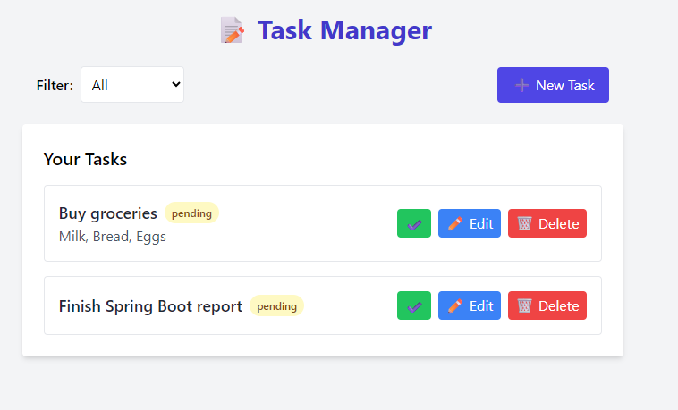

# 📝 TaskManager

A clean, modern task manager built with **Spring Boot** (Java) for the backend and **vanilla HTML/CSS/JavaScript** for the frontend.

---

## 🚀 Features

- ✅ Create, Read, Update, Delete (CRUD) Tasks  
- ✅ Filter by Pending / Completed  
- ✅ Mark tasks as completed  
- ✅ Edit or delete tasks  
- ✅ Responsive UI with clean animations  
- ✅ REST API built with Spring Boot  
- ✅ Stylish UI with Tailwind CSS + Feather icons  
- ✅ Vanta.js animated background for a modern look  

---

## 📦 Backend: Spring Boot

### 📁 Technologies

- Java 17 or 21  
- Spring Boot 3.1+  
- Spring Data JPA  
- PostgreSQL (or any relational DB)  
- Maven  

### 📄 Setup

1. **Clone the repo**

    ```bash
    git clone https://github.com/your-username/taskmanager.git
    cd taskmanager
    ```

2. **Configure PostgreSQL**

    - Create a database named `taskdb`
    - Update credentials in `src/main/resources/application.yml`:

    ```yaml
    spring:
      datasource:
        url: jdbc:postgresql://localhost:5432/taskdb
        username: postgres
        password: yourpassword
    ```

3. **Run the backend**

    ```bash
    ./mvnw spring-boot:run
    ```

> Your backend will be live at: `http://localhost:8080`

---

## 🌐 Frontend: HTML + CSS + JavaScript

### 📁 Location

Place your `index.html` in:

````

src/main/resources/static/index.html

````

### ✅ Features

- No frameworks required  
- Uses `fetch()` to call Spring Boot REST APIs  
- Feather icons  
- Vanta.js background animation  
- Tailwind CSS (via CDN)  

### 🧪 Sample Screenshot



---

## 🔗 API Endpoints

| Method | Endpoint          | Description          |
| ------ | ----------------- | -------------------- |
| GET    | `/api/tasks`      | Get all tasks        |
| GET    | `/api/tasks/{id}` | Get task by ID       |
| POST   | `/api/tasks`      | Create new task      |
| PUT    | `/api/tasks/{id}` | Update task          |
| DELETE | `/api/tasks/{id}` | Delete task          |

---

## 🛠️ Usage

- **Add Task**: Click the **New Task** button and fill the form.  
- **Edit Task**: Click the three-dot menu on a task to edit or delete.  
- **Mark Completed**: Toggle the checkbox to mark as completed.  
- **Filter Tasks**: Use the filter buttons to show all, completed, or pending tasks.  

---

## 🖥️ Deployment Tips

- Build the backend with:

    ```bash
    ./mvnw clean package
    ```

- Deploy the generated `jar` on your preferred server or cloud platform.

- For production, consider configuring CORS and environment-specific properties.

- If using HTTPS, configure SSL in Spring Boot or reverse proxy.

---

## ⚠️ Troubleshooting

- **Frontend not updating?**  
  Clear your browser cache or hard refresh (`Ctrl+Shift+R`).

- **API calls failing?**  
  Ensure backend is running at `http://localhost:8080` and CORS is configured correctly.

- **Database connection issues?**  
  Verify PostgreSQL service and credentials in `application.yml`.

- **Screenshot not displaying in README?**  
  Make sure `screenshot.png` is in the repo root and path in markdown is correct.

---

## 🛠️ Future Improvements

- Tag filtering and search  
- Due dates & reminders with notifications  
- Drag-and-drop task reordering  
- Dark mode toggle  
- Mobile-first UI enhancements  
- User authentication and multi-user support  

---

## 🤝 Contributing

Pull requests are welcome! For major changes, please open an issue first to discuss.

---
## 📄 License

This project is open source. Please check the repository for license information.

## 🙏 Acknowledgments

- Thanks to all contributors who have helped shape this project
- Inspired by the open-source community
- Built with ❤️ and modern development practices


## 👨‍💻 Author

**Rajeev Nayan** – [LinkedIn](https://linkedin.com/in/imrajeevnayan) | [GitHub](https://github.com/imrajeevnayan)

---

